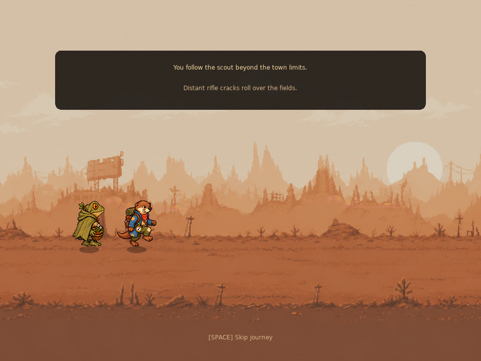
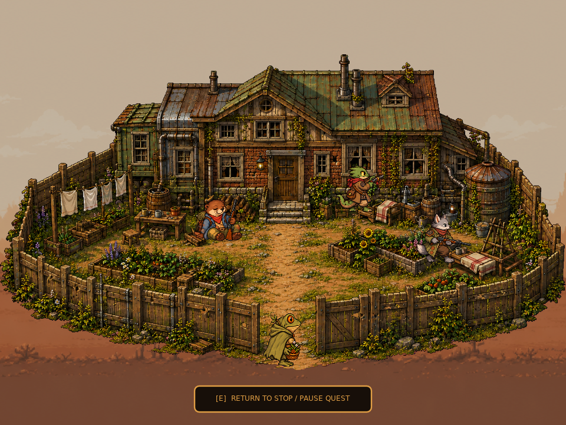
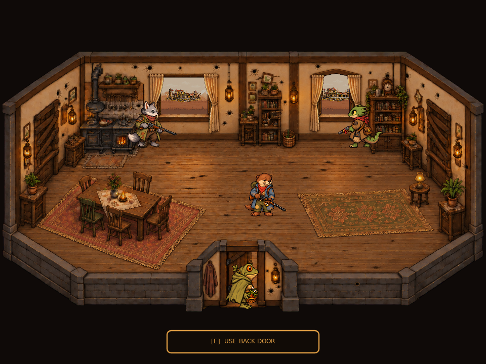
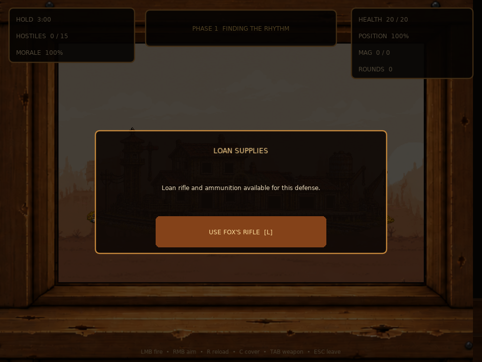
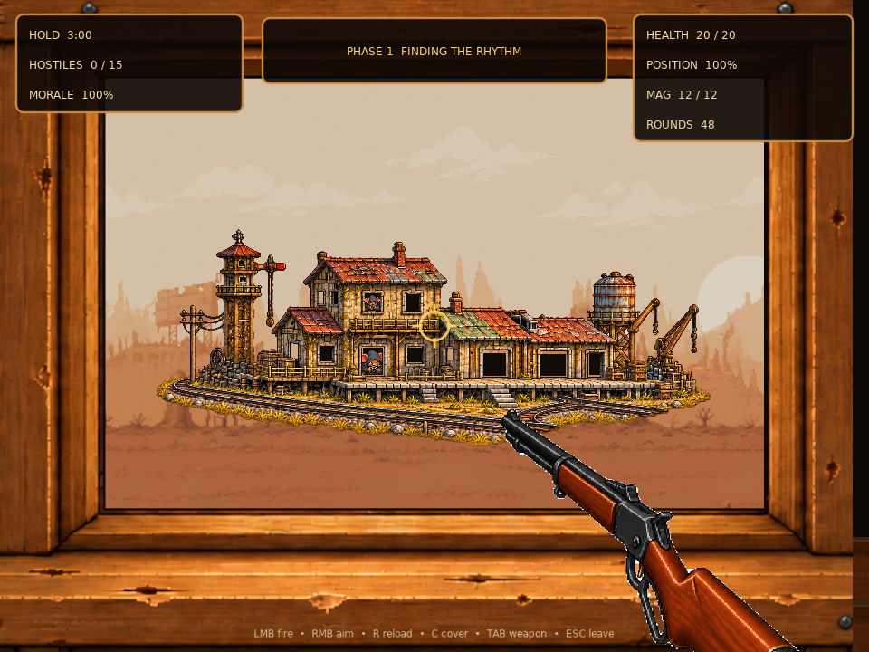
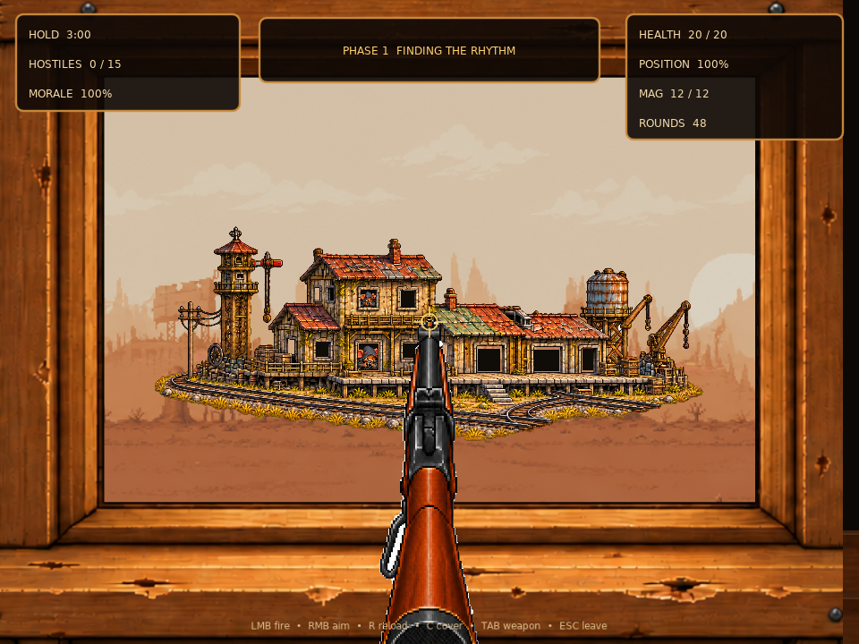
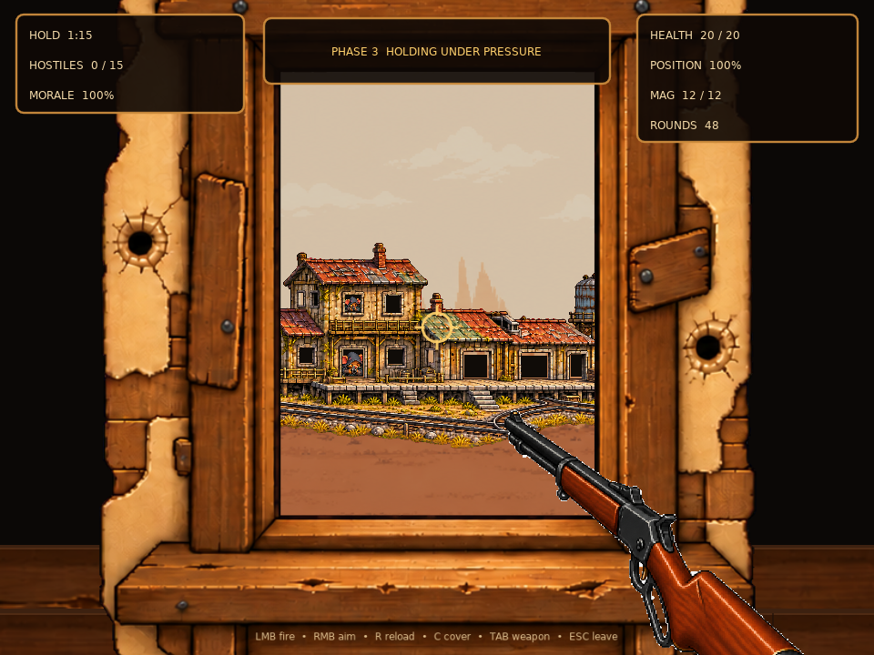
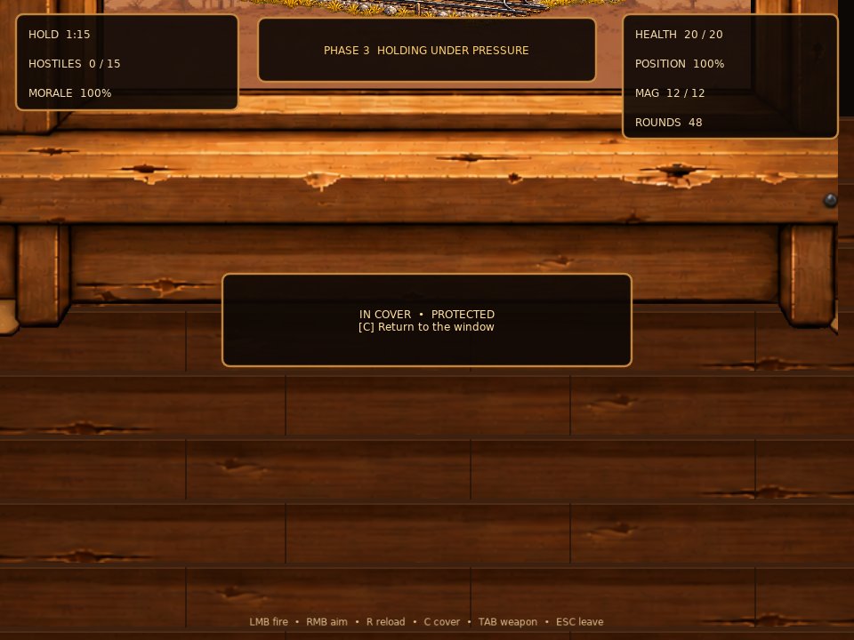
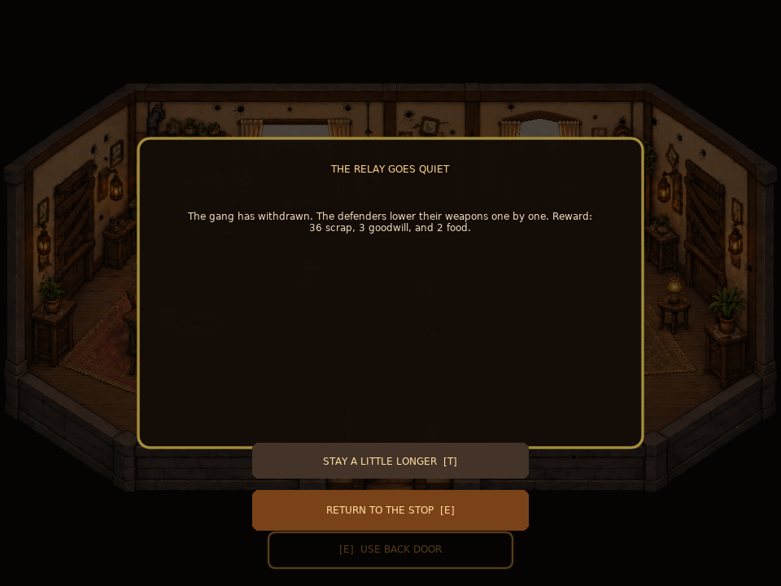
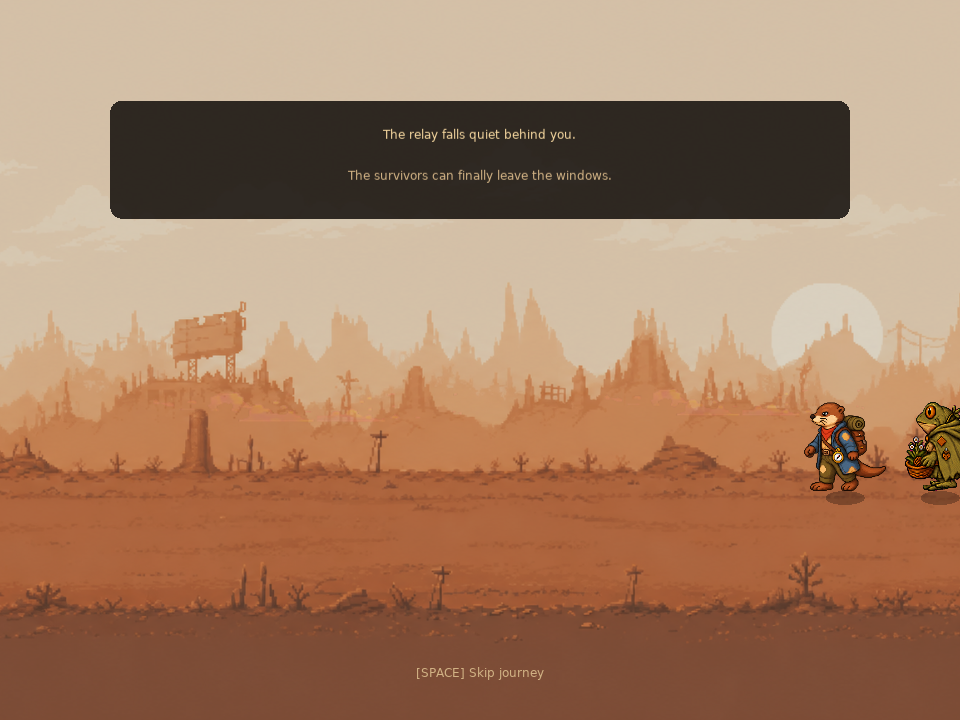

# Shootout review: current playable flow

This is a numbered walkthrough of **A Light in the Windows**, from the scout's approach to the return trip. Use the IDs (`S01`, `S02`, etc.) when requesting changes. The pictures are captures from the current game renderer at controlled review states. They show the location 4 landscape, a sample player character, and representative enemy positions; they are not one continuous playthrough. No existing save was loaded or changed to make them.

This describes the current implementation. Older quest and dialogue design documents contain plans that differ from what is playable now. The review does not introduce or approve character dialogue.

## The whole path

```text
Scout approaches → Offer → Escort → Backyard → Interior → Choose window
                                                    ↓
              ┌──────────── Shoot / aim / cover / reload ────────────┐
              │ Phase 1 → break → Phase 2 → break → Phase 3 → Phase 4 │
              │          ↕ leave window, change window, get supplies  │
              └─────────────── 180s + 15 kills + 0 morale ───────────┘
                                                    ↓
                Enemy withdrawal → Check resident → Guard Fox reward
                                                    ↓
                                  Stay or return to original stop
```

## S01 — The scout finds the player

**Current experience.** At a stopped location numbered 4–49, while ordinary play is available, the Otter Scout walks toward the player. The scout waits if another activity is in progress. The offer opens automatically after the scout arrives, or the player can interact with the scout after a declined or paused attempt.

**Review focus.** When this starts; whether the approach should interrupt exploration; how obvious the scout is.

## S02 — Accept or delay the defense

**Current experience.** The offer is a five-page objective panel. It explains the farmhouse, wounded residents, two windows, 300-meter relay sight line, three-minute defense target, and available rifle. Buttons let the player accept, delay, or jump to objective and supply pages. Delaying keeps the scout available at that stop. Accepting records the return stop and player position and starts a fresh defense.

**Review focus.** Amount and order of information; button labels; whether the player understands that delaying is reversible.

## S03 — Follow the scout



**Current experience.** An approximately eight-second travel transition shows the scout and player crossing in front of the distant relay view; the backyard appears toward the end. Both now use their directional walk and idle animation sets at a matching scale. The walking frames advance with the distance they travel, and both face the direction of the journey. It can be skipped. Reduced-motion mode holds them together in their directional idle poses.

**Review focus.** Journey length, clarity, and visual tone.

## S04 — Arrive in the backyard



**Current experience.** The fenced yard now sits over the location's distant landscape, filling the space beyond the house and fence. The player is drawn at a scale comparable to the defenders. The back door enters the house. The scout is on the left; the wounded interaction is on the right. The gate at the bottom returns the player to the original stop and **pauses** an unfinished defense. The offer can be resumed through the scout at that stop.

**Optional branch.** Helping the wounded opens the existing first-aid activity. Completing it permanently marks the treatment done and restores 12 points of position integrity, up to 100. It also makes an extra reward possible at the end.

**Review focus.** Route to the door; placement and visibility of the wounded interaction; whether the gate's pause behavior is clear.

## S05 — Enter the house and choose a position



**Current experience.** The room is walkable, and the player keeps the same character scale after entering. The left window belongs to Guard Fox, the right to Gecko Ranger. The player can also talk to them and use the back door. Interacting near a window starts a roughly 0.75-second defender handoff, then opens the shooting view. Pressing Escape during the handoff cancels it.

**Review focus.** Furniture and damage; whether each window reads as usable; defender placement; the handoff animation.

## S06 — Choose a weapon or take supplies



**Current experience.** A usable personal firearm with compatible ammo is selected automatically. Otherwise, the shootout presents the house rifle supply prompt. Guard Fox can also lend the Frontier .22 rifle from the room. The first loan supplies 48 quest-only rounds; when depleted, another 12-round pouch is available. The player can switch between a personal firearm and the house rifle. Personal ammunition is spent only with the personal gun. Loaded rounds and remaining ammunition carry across window changes.

**Review focus.** When the supply offer appears; whether the rifle is clearly temporary; how refills and weapon switching should feel.

## S07 — Defend from the wide window



**Current experience.** The wider opening shows more of the station and can accommodate more simultaneous enemies. The left HUD shows time remaining to the 180-second hold threshold, confirmed eliminations toward 15, and enemy morale. The right HUD shows player health, house position integrity, magazine, and total rounds. A phase banner appears on entry and phase changes.

**Review focus.** Sight line, target size, visibility of the station openings, weapon scale, HUD placement and wording.

## S08 — Aim, fire, and read enemy behavior



**Current experience.** Eight station apertures can host enemies: two upper windows, an annex opening, center door, center window, two loading bays, and a side door. A target appears, is exposed for a short interval, fires, hides, and eventually returns. A confirmed hit starts a visible death state, adds one elimination, and lowers morale by 4 for a standard shooter or 7 for a heavy shooter. Hitting solid station scenery creates an impact effect. After morale falls, fewer enemies can be active and new exposures arrive more slowly.

**Current target sequence.** Hidden → appearing (~0.24s) → exposed (~0.85–1.65s, longer when the hold target is met but eliminations are short) → firing (~0.16s) → hiding (~0.22s) → hidden. A defeated target uses a ~0.72-second dying state before the aperture clears.

**Review focus.** Whether each aperture is easy to read; whether the warning before a shot is fair; enemy size, pose, timing, and hit feedback.

## S09 — Switch to the tall window



**Current experience.** Escape leaves the shooting view for the room; the player walks to the other window and interacts again. The tall opening crops the same station more tightly. It caps simultaneous enemies at four rather than five and multiplies incoming position damage and hit chance by 0.68. The hold time, eliminations, morale, ammo, targets, and damage carry across the switch.

**Review focus.** Whether the two positions feel meaningfully different; whether the tall view has enough useful targets; switching effort.

## S10 — Duck behind cover



**Current experience.** Cover lowers the view below the sill in about 0.28 seconds. While fully or partially covered, incoming fire cannot hurt the player or the position. The player cannot fire until back up. **Hold time stops while ducking.** The current screen still shows the HUD and an in-cover notice.

**Review focus.** Cover motion, protection clarity, time tradeoff, and whether the covered screen conveys the battle outside.

## S11 — Move through four phases

The clock counts only while the player is in a contested firing view, not ducking, and has a usable ammunition source. The player can also pause, leave the window, or use the room and yard between pushes.

| Phase | Active hold time | Typical concurrent shooters before morale scaling | What happens at the boundary |
| --- | ---: | ---: | --- |
| 1 · Finding the rhythm | 0–45 seconds | 2 | First forced break at 45 seconds |
| 2 · Crossfire | 45–105 seconds | 3 | Second forced break at 105 seconds |
| 3 · Holding under pressure | 105–165 seconds | Up to 5 wide / 4 tall | Flows directly into phase 4 |
| 4 · Breaking their nerve | 165 seconds onward | Up to 4 | Continue until all victory conditions are met |

Each phase completion lowers enemy morale by 6. Staying actively exposed reduces morale by 1 every eight seconds; after four minutes, assistance increases that to 3. The 45- and 105-second breaks return the player to the interior. The player must choose a window again to continue. This **four-phase** structure is the current code, even though some older notes describe three phases.

**Review focus.** Overall length, pace of each phase, whether two forced breaks are useful, and how the phase transition is presented.

## S12 — Take incoming fire and recover

**Current experience.** An enemy's firing state produces a muzzle flash. An exposed player loses a small amount of position integrity on every enemy shot. Some shots also remove 1 health, or 2 from a heavy shooter, with a short hit-recovery interval preventing immediate repeated health hits. Every third enemy shot adds a damage decal to a valid window surface. Health can fall to 1 but not below it here.

**Failure branch.** If position integrity reaches zero or health reaches 1, the player is pulled back into the room. The current phase restarts from its checkpoint with 65% position integrity; earlier time and confirmed eliminations remain. Health is not silently restored. The player may return to the original stop to heal, then resume.

**Review focus.** Fairness of incoming fire; warning and damage feedback; clarity of the recovery state.

## S13 — Force the withdrawal

**Current experience.** All three conditions must be true: at least **180 active seconds**, **15 confirmed eliminations**, and **0 enemy morale**. Surviving visible targets withdraw over roughly five seconds. The player returns to the interior. The windows cannot restart combat after victory.

**Review focus.** Whether the victory conditions are understandable; pacing near the end; how the retreat reads visually and audibly.

## S14 — Check a resident and claim the reward



**Current experience.** The player must check on a resident after the retreat, then speak to Guard Fox to claim the reward. The standard reward is **28 scrap, 3 goodwill, and 2 food**. It becomes **36 scrap** if the wounded resident was treated and position integrity is at least 40 at the end. The house rifle and its ammunition are removed. The reward is claimed only once.

**Review focus.** Whether the resident check feels necessary; reward amount and presentation; what the optional treatment should change.

## S15 — Stay or return



**Current experience.** The reward screen offers a chance to remain in the house or start the return trip. The player can also leave through the backyard gate after claiming the reward. The return transition lasts about five seconds and can be skipped. It restores the original stop and approximate player position. The quest then stays complete and does not repeat in that playthrough.

**Review focus.** Whether the player has enough time in the quiet house; return timing and final sense of closure.

## Controls currently exposed

| Action | Mouse / keyboard | Gamepad | Touch |
| --- | --- | --- | --- |
| Fire | Left click or Space | Right trigger | FIRE button or second touch |
| Aim down sights | Hold right click | Left trigger | AIM toggle |
| Reload | R | X | RELOAD |
| Duck / rise | C | Left shoulder | COVER |
| Borrow / refill | L | Y | SUPPLY |
| Cycle firearm | Tab | Back | WEAPON |
| Leave window | Escape | B | LEAVE |
| Interact in room / yard | E or Enter | A | Tap action prompt |
| Pause | P | Start | App focus loss also pauses |

Reduced-motion and reduced-flash settings are read by the scene and shootout. Touch controls add a bottom action row. Saving during active combat restores the player to the interior with battle progress retained. Returning to the origin stop before victory pauses the defense; it does not erase it.

## Notes for the next review pass

Use a step ID and name the desired change, for example: `S09: make the tall view show more of the loading bay` or `S11: move the second break later`. It is also fine to say that a visual, control, or whole step should be replaced. Character speech or player spoken choices require wording supplied or explicitly approved by you before they are changed.

Implementation reference: `game/last_stand_quest.lua`, `game/last_stand_scene.lua`, `game/last_stand_shootout.lua`, `game/last_stand_tuning.lua`, and `game/window_scene.lua`.
