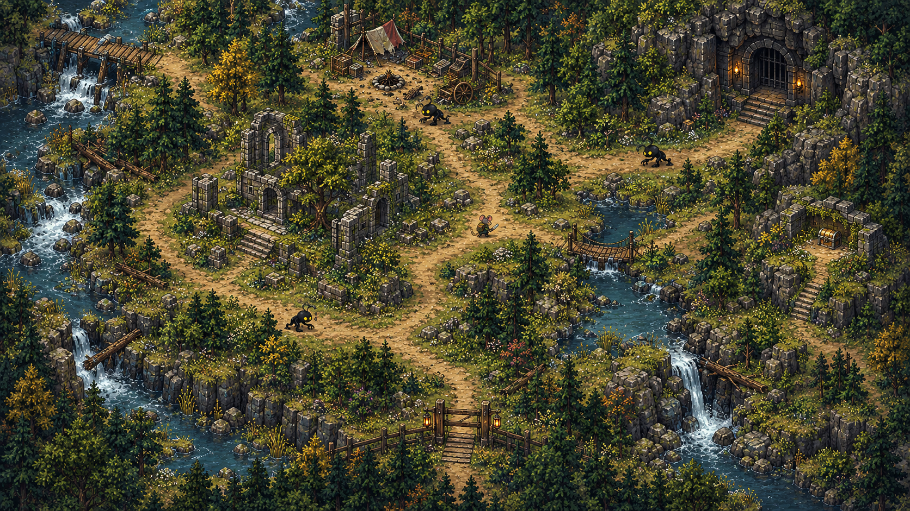
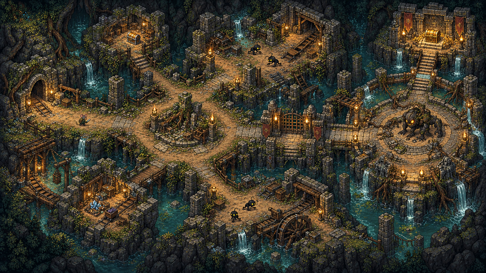

# Wilderness Expeditions

> **Pilot status:** The Stop 6 vertical slice is implemented as Riverwood Outskirts plus Buried Waystation. See [WILDERNESS_EXPEDITIONS_VERTICAL_SLICE.md](WILDERNESS_EXPEDITIONS_VERTICAL_SLICE.md) for the playable route, exact content, tuning, art contract, and expansion recipe.

## Concept

Selected stops gain an exit that leads to a large explorable area beyond town. These wilderness maps use the same painted isometric presentation and walk-mask movement as the current settlement sprites, but they are larger, more open, and viewed from a more overhead angle.

The key hook is hybrid combat:

- Enemies physically patrol the map.
- A nearby enemy notices and chases the player.
- The player can dodge and strike it in real time with an equipped melee weapon.
- Every successful real-time hit reduces that exact enemy's persistent health.
- If an enemy successfully hits the player, the game transitions into the normal turn-based battle system.
- Every enemy enters the battle with the health it had on the exploration map.
- A skilled player can kill a roaming enemy without entering formal combat at all.

This makes exploration active without replacing the tactical battle system. Real-time play determines whether the battle begins and how favorable its starting state is; turn-based combat remains the consequence for getting caught.

## Concept art

### Surface wilderness



The surface concept shows the intended visual grammar:

- A clear route back to the stop at the bottom edge.
- Broad loops instead of narrow maze corridors.
- Natural boundaries made from water, cliffs, trees, and rubble.
- A ruin clearing that acts as a landmark and combat space.
- A side-route chest that rewards looking beyond the main path.
- Several readable patrol spaces for roaming enemies.
- A dungeon entrance visible as a long-term destination.

### Dungeon



The dungeon uses the same exploration controls and hybrid enemy behavior. Its structure is denser but still favors broad rooms and short loops:

- Entrance chamber and central hub.
- Two optional loot branches.
- Multiple enemy patrol rooms.
- A gated boss threshold.
- A large boss arena with room to dodge.
- A visible treasure vault beyond the boss.

## Player-facing loop

1. Arrive at a stop and enter town normally.
2. Find an exit beacon labeled **Explore Outskirts** at a stop that supports expeditions.
3. Enter the wilderness at its return gate.
4. Follow landmarks, leave the path for salvage, open chests, and avoid or attack roaming mobs.
5. If a mob lands a hit, fight the engaged mob or pack using the existing turn-based system.
6. Discover the dungeon entrance and enter a separate dungeon area.
7. Clear patrol rooms or retrieve the object that opens the boss gate.
8. Defeat the boss or final enemy pack.
9. Open the boss vault and return to town.

The player may retreat to town from the surface gate or return to the surface from the dungeon entrance at any time outside combat.

## Design pillars

### Exploration must be readable

The environment should be rich, but the traversable routes must remain obvious. Every area needs one main loop, one or two optional detours, and memorable landmarks. The player should rarely wonder whether an apparently open surface is actually blocked.

### Real-time skill creates an advantage

Dodging and landing melee hits is meaningful because damage carries into combat exactly. The exploration layer does not secretly heal enemies or reduce the value of a successful strike.

### Turn-based combat remains the danger state

A mob does not start a battle merely by overlapping the player. It must complete a visible attack and connect with its hit area. This gives the player a fair dodge window and makes the transition feel earned.

### Rewards justify the risk

Normal chests provide useful supplies or ordinary loot. The dungeon vault provides the area's best reward and should feel visibly more important before it is opened.

### One shared ruleset

Surface and dungeon exploration should use the same movement, interaction, mob, melee, camera, and save-state systems. A dungeon is an expedition area with a different environment and progression gate, not a separate game mode.

## Map structure and asset model

The current game uses a 960 x 720 logical viewport and settlement-wide painted sprites with matching walk masks. Expeditions can extend this model without introducing tile-based movement.

### Recommended vertical-slice size

- Logical world: 1920 x 1080.
- Visible camera window: 960 x 720.
- Authored art master: approximately 3344 x 1882, preserving the texture density and 16:9 shape of the current 1672 x 941 stop art.
- Shipping layout: four 1672 x 941 quadrants or another streamable split, so mobile devices do not need to keep every large map texture resident.
- Walk mask: one low-resolution mask covering the full logical world, or one aligned mask per art quadrant.

The exact production resolution can be adjusted after a mobile memory test. The important prototype target is roughly two screen widths and one-and-a-half screen heights of movement space.

### Map layers

Each expedition area needs:

1. Painted background art.
2. Walkable mask.
3. Optional foreground/occlusion pieces for trees, arches, and tall walls.
4. Marker manifest containing entrances, exits, chests, patrol regions, mob spawns, boss gate, boss arena, and vault.
5. Optional ambient layer for water, fire, fog, leaves, or dust.

The painted map supplies visual richness. The walk mask and marker manifest supply gameplay meaning.

### Camera

- Follow the player with a small dead zone so every footstep does not move the screen.
- Clamp at the map edges.
- Keep the current global zoom/accessibility behavior.
- Convert pointer input through both the existing viewport transform and the expedition camera offset.
- Pause camera and world movement when an inventory, dialogue, chest, map, or other blocking panel is open.

## Roaming mob behavior

Each mob is a persistent entity with a stable `mobId`. Suggested states are:

| State | Behavior |
| --- | --- |
| Patrol | Walk between points inside a patrol region, occasionally pausing. |
| Alert | Face the player and show a brief visual/audio tell before pursuit. |
| Chase | Move toward the player while respecting the walk mask and simple obstacle avoidance. |
| Wind-up | Stop or slow down, telegraph the attack, and lock its direction. |
| Strike | Perform a short lunge or swipe with an actual hit area. |
| Recover | Brief vulnerability after a missed or completed attack. |
| Leash | Return to the patrol region if pulled too far or if the player reaches a safe gate. |
| Hit | Flash, recoil, reduce health, then become alert or resume chase. |
| Dead | Play the death animation, disable collision, and resolve its drops once. |

Suggested first-pass tuning:

- Awareness radius: 180 world units.
- Lose-interest radius: 320 world units from the patrol home.
- Alert tell: 0.25 to 0.4 seconds.
- Attack wind-up: 0.35 to 0.55 seconds.
- Strike window: about 0.16 seconds.
- Recovery: 0.5 to 0.7 seconds.
- Player melee reach and cooldown: initially reuse the current sludge-crawler values of approximately 150 units and 0.42 seconds.

These numbers are prototype values, not final balance. Larger mobs can trade speed for reach; small mobs can be fast but fragile.

### Aggro packs

A mob can have an optional `packId`. When one pack member is attacked or becomes alert, nearby members join the chase. If one lands a hit, the tactical encounter includes:

- The attacker.
- Other living pack members already alert and within a participation radius.
- Their exact current health values.

Unaware mobs elsewhere on the map do not teleport into the battle.

## Real-time melee rules

The first version should support melee only. This reuses the current stop-sludge interaction and avoids solving projectile collision, ammunition, and long-range pulling at the same time.

On a player attack:

1. Require a non-ranged weapon in either equipped hand.
2. Play the normal character melee action and weapon sound.
3. Test the weapon arc against the nearest eligible mob.
4. Roll damage from the existing catalog weapon stats.
5. Subtract that damage directly from the roaming entity's health.
6. Show hit flash, damage number, and a temporary health bar.
7. Alert the target and its nearby pack.
8. If health reaches zero, play its death sequence and never include it in a later battle.

For the vertical slice, status effects, critical hits, knockback, durability loss, and weapon proficiency can remain turn-based-only unless testing shows that their absence feels inconsistent.

## The battle handoff

This is the core technical contract.

### Trigger

A tactical battle starts only when a mob's telegraphed strike overlaps the player's vulnerable area during the strike window. Mere body overlap or pathfinding contact is not a hit.

The exploration hit does not also remove player health. Its consequence is entering battle, which prevents an unfair double penalty before the player receives a turn.

### Encounter payload

The roaming system sends the normal battle runtime an encounter containing stable enemy state and a return context:

```lua
{
    source = "expedition",
    areaId = "stop06-outskirts",
    returnScene = "expedition",
    returnX = 1032,
    returnY = 618,
    mobIds = {"surface-sludge-a", "surface-sludge-b"},
    enemyStates = {
        ["surface-sludge-a"] = {
            file = "sludge-crawler",
            hp = 4,
            maxHp = 18,
            tier = 1
        },
        ["surface-sludge-b"] = {
            file = "sludge-crawler",
            hp = 13,
            maxHp = 18,
            tier = 1
        }
    }
}
```

### Starting health

When battle units are created, each enemy uses its roaming `hp` and `maxHp` rather than receiving a new full-health value. Health is clamped only to valid bounds; it is not raised to a hidden minimum. If the player reduced an enemy to 1 HP, it begins at 1 HP.

### Resolution

- Victory: mark every defeated participating `mobId` dead in the expedition state, grant battle rewards once, and return to the stored area position.
- Surviving or escaped enemy: copy its tactical health back to the roaming entity before returning.
- Player loss: keep the game's current consequence of returning to the train with recovery health.
- Player retreat from battle: safest first-pass rule is also to return to the train, preventing retreat from becoming a free teleport through a dangerous area.

The current battle flow returns victories to the stop. Expedition encounters therefore need an explicit return context rather than always calling the normal stop entry function.

## Chests, salvage, and rewards

### Surface rewards

- One visible but off-route ordinary chest.
- Two or three loose salvage points in ruins or abandoned camps.
- Mob drops using the existing reward or dropped-item presentation.
- Optional environmental clue that points toward the dungeon.

### Dungeon rewards

- One ordinary chest on an optional branch.
- One resource cache in a riskier patrol room.
- One high-value vault chest that remains unavailable until the boss encounter is resolved.

### Persistence and anti-farming

- Every chest has a stable `chestId` and an `opened` flag.
- Roll randomized contents the first time the chest is opened, then store the result before presenting it.
- Every mob reward has a resolved flag so death animation, battle victory, reload, or scene transition cannot duplicate it.
- For the first version, defeated expedition mobs and opened chests remain resolved permanently for that save.
- A later repeatable-expedition feature can deliberately repopulate selected patrols after a number of train stops, but boss vaults should remain first-clear rewards.

Existing inventory/storage UI can present a chest. Expedition chests should not behave like player-owned permanent storage unless a particular chest is intentionally designed that way.

## Dungeon progression

The first dungeon should be short enough to finish in one focused outing:

1. Enter and see the boss vault or boss route from a distance.
2. Explore a central hub.
3. Clear one or two patrol spaces or retrieve a gate object.
4. Open the boss threshold.
5. Approach the visible boss sprite.
6. Dodge and pre-damage the boss in real time, or get hit and enter the tactical boss battle.
7. Open the newly available vault.
8. Exit back to the surface at the dungeon entrance.

The boss follows the same health-carry rule as ordinary mobs. It can be made difficult through faster tells, broader attack areas, supporting mobs, armor, and tactical abilities rather than by erasing damage earned during exploration.

## Save-state shape

A new root table such as `expeditions` keeps persistent expedition state separate from the existing `stopSludges` proof of concept.

```lua
expeditions = {
    ["stop06-outskirts"] = {
        discovered = true,
        completed = false,
        mobs = {
            ["surface-sludge-a"] = {hp = 0, maxHp = 18, dead = true, rewardResolved = true},
            ["surface-sludge-b"] = {hp = 13, maxHp = 18, dead = false}
        },
        chests = {
            ["ruin-chest"] = {opened = true, contentsResolved = true}
        },
        gates = {
            dungeonEntranceDiscovered = true
        }
    },
    ["stop06-buried-waystation"] = {
        discovered = true,
        completed = false,
        mobs = {},
        chests = {},
        gates = {bossGateOpen = false, vaultOpen = false}
    }
}
```

Only durable facts need saving: mob health/death, opened rewards, gates, completion, discovery, and the player's current area/return position when saving in an expedition. Patrol targets, alert timers, and animation frames can be rebuilt on load.

Because the save validator is versioned and strict, implementation should add a schema migration and validation for this table rather than attaching it ad hoc.

## Recommended code boundaries

This is an implementation map, not a requirement to place every function in a new file.

- `game/expedition_areas.lua`: content manifest, area availability by stop, markers, art paths, walk masks, and transitions.
- `game/expedition_runtime.lua`: current area, player movement, camera, gates, chests, and scene transitions.
- `game/roaming_mobs.lua`: generalized version of the current stop-sludge proof of concept with patrol, aggro, attacks, health persistence, and encounter payload creation.
- `game/world_renderer.lua`: add expedition rendering or route the expedition scene to a dedicated renderer.
- `game/gameplay_update.lua` and `game/gameplay_input.lua`: route expedition update, movement, interaction, and melee actions.
- `game/battle_controller.lua`: accept per-enemy starting health and stable mob IDs.
- `game/battle_runtime.lua`: return to the stored expedition context after victory.
- `game/interaction_router.lua`: add area exits, dungeon entrances, gates, and one-time loot containers.
- `game/asset_streamer.lua`: keep only nearby map quadrants and the active area's mob assets resident.
- `game/save_schema.lua`: add and validate the expedition save table through a versioned migration.

Systems to reuse rather than duplicate:

- Existing character movement and melee animation.
- Current stop-sludge weapon detection, damage roll, hit feedback, and death/drop concepts.
- Existing battle runtime, controller, grid, unit art, rewards, and party-member rules.
- Existing loot progression and inventory delivery.
- Existing interaction beacons and input behavior.
- Existing viewport and accessibility zoom.

## First vertical slice

Use one existing wilderness-facing stop, preferably the forest/river visual family represented by stop 6 or stop 16.

### Content

- One surface area.
- One surface exit back to town.
- Three sludge crawlers with separate health.
- One ruin landmark.
- One ordinary chest.
- One dungeon entrance.
- One compact dungeon.
- Two dungeon patrol groups.
- One boss sprite plus optional support mobs.
- One boss vault chest.

### Implementation order

1. Large background, walk mask, camera follow, and return-to-stop transition.
2. Roaming mob patrol, alert, chase, wind-up, strike, and leash.
3. Real-time melee damage and persistent mob health.
4. Battle handoff with exact enemy health and correct return context.
5. One-time chest persistence and loot delivery.
6. Dungeon scene transition and shared exploration runtime.
7. Boss gate, boss encounter, vault, and area completion.
8. Save/load, mobile controls, performance checks, and regression tests.

## Acceptance criteria

The vertical slice is successful when:

- The player can leave one stop, explore an area larger than the screen, and return.
- The camera follows smoothly and never shows beyond the authored map.
- Walkable ground matches the art and cannot be bypassed at mask edges.
- Roaming mobs visibly patrol, alert, chase, telegraph, strike, recover, and leash.
- Body contact alone does not start battle.
- The player can hit a mob multiple times with a melee weapon and kill it outside battle.
- A mob that lands a strike starts the existing tactical battle.
- Every participating enemy begins with its exact remaining roaming health.
- Victory returns the player to the correct surface or dungeon position.
- Defeated mobs and opened chests stay resolved across scene changes and save/load.
- The dungeon boss unlocks a high-value vault and cannot pay its reward twice.
- Existing stop, train, inventory, event, and ordinary battle flows still work.

## Recommended defaults for unresolved choices

- Feature name: **Wilderness Expeditions**; interaction label: **Explore Outskirts**.
- Availability: only authored stops with an expedition manifest, not every stop.
- Party behavior: passengers remain off-map but join tactical battles under the existing party rules.
- Player damage at handoff: no exploration-layer damage; the landed mob hit is the battle trigger.
- Enemy persistence: permanent defeat for the first version.
- Chest persistence: one-time per save.
- Ranged exploration attacks: defer until the melee vertical slice is stable.
- Boss rule: exact damage carryover with no hidden healing.
- Battle retreat: return to train.
- Battle victory: return to the precise expedition area and position.

## Expansion path

After the vertical slice is stable, the same framework can support desert scrapyards, flooded wetlands, burned forest, ghost-town outskirts, snow passes, caves, bunker interiors, and rail tunnels. Each new area mostly supplies art, a walk mask, markers, patrol definitions, a mob set, and reward tables while sharing the same runtime.
