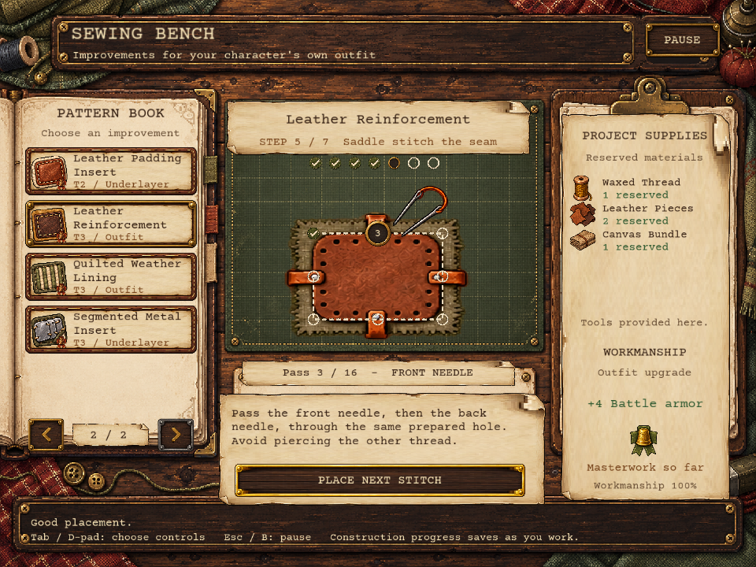

# Outfit crafting: implemented first pass

The sewing bench makes improvements to each character's existing outfit. Finished panels become ordinary inventory items, then apply their benefits when installed in **Outfit Upgrade** or **Underlayer**. Character sprites and animations stay unchanged. One improvement fits each slot; backpacks retain their separate slot.

## Access and supplies

On the stopped train, open the inventory and choose **Sewing Bench** or **Weapon Repair**, or enter either station from the train workshop. Close other activities first. The sewing bench pauses the world and supplies reusable marking, cutting, sewing, leatherworking, and sheet-metal tools. Carry the required material bundles in the backpack before starting; every bundle occupies one inventory slot.

| Material | First available | Base merchant price per bundle |
| --- | --- | ---: |
| Thread Spool | Stop 1 | 2 scrap |
| Fabric Scraps | Stop 1 | 2 scrap |
| Wool Batting | Stop 1 | 3 scrap |
| Canvas Bundle | Stop 7 | 4 scrap |
| Leather Pieces | Stop 7 | 5 scrap |
| Waxed Thread | Stop 7 | 4 scrap |
| Thin Metal Sheet | Stop 13 | 7 scrap |

Each house receives one sewing cache containing thread, fabric, and one random material available at that stop. Ordinary stop merchants receive three bundles of each available material. These supplies are finite: reopening a house or merchant does not replenish them. Older saved houses and merchants receive this added supply layer once while preserving their existing contents. Merchant relationship terms can change purchase prices.

## Recipes

Counts below are whole bundles. All patterns are visible immediately; material availability controls progression. The listed bonuses apply to Usable and Fine work.

| Tier | Pattern | Slot | Material cost | Battle bonuses |
| --- | --- | --- | --- | --- |
| 1 | Cloth Repair Patch | Outfit Upgrade | 1 thread, 1 fabric | +1 armor |
| 1 | Quilted Wool Lining | Outfit Upgrade | 1 thread, 1 fabric, 1 wool | +1 armor |
| 1 | Padded Cloth Insert | Underlayer | 1 thread, 2 fabric | +1 armor |
| 2 | Canvas Reinforcement | Outfit Upgrade | 1 thread, 2 canvas, 1 fabric | +2 armor |
| 2 | Mobility Gusset | Outfit Upgrade | 1 thread, 2 fabric | +1 movement |
| 2 | Leather Padding Insert | Underlayer | 1 waxed thread, 1 leather, 1 fabric, 1 wool | +2 armor |
| 3 | Leather Reinforcement | Outfit Upgrade | 1 waxed thread, 2 leather, 1 canvas | +3 armor |
| 3 | Quilted Weather Lining | Outfit Upgrade | 1 waxed thread, 1 canvas, 1 fabric, 2 wool | +2 armor, +1 movement |
| 3 | Segmented Metal Insert | Underlayer | 1 waxed thread, 2 metal, 1 canvas, 1 fabric, 1 wool | +3 armor, -1 movement |

The first pass uses existing tactical battle armor and movement. Armor improves defense and reduces received damage; movement changes the player's available battle movement. Installed bonuses combine across the two slots, and removing an upgrade removes its effects. These bonuses do not change overworld speed or first-person shootout damage. There is currently no temperature, cold exposure, or insulation stat; wool linings provide cushioning through armor.

## Construction and workmanship

Each pattern follows its material's preparation and assembly process. The numbered marks represent short stretches of work; the tension step represents drawing a seam snug without leaving loose loops or puckering it.

- **Cloth and canvas:** mark a panel with seam allowance, cut the complete outline, turn and pin the raw edges, backstitch the seam, set tension, and secure the thread ends.
- **Quilted layers:** align the backing, filling, and facing, quilt rows to hold the layers together, then cover the raw edges with binding. Wool uses a gentler tension range to preserve its loft. Background: Utah State University Extension's [Machine Quilting](https://extension.usu.edu/sewing/research/machine-quilting) and [Binding a Quilt](https://extension.usu.edu/sewing/research/binding-a-quilt). The game represents hand stitching with simplified point actions.
- **Mobility gusset:** mark and cut a diamond panel, align it in an opened seam, backstitch its inset perimeter, then finish the seam allowance and secure the thread.
- **Leather:** mark and cut, align the backing, pierce seam holes with an awl, pass both needles through each prepared hole, set tension, and backstitch to finish. Technique background: [Tandy Skills: Saddle Stitching](https://tandyleather.com/blogs/tandy-blog/tandy-skills-saddle-stitching).
- **Thin metal insert:** mark and snip segments, file the edges, punch fastening holes, smooth the holes, arrange the segments over padding, lash through the prepared holes, and sew a fabric cover around the outside margin. The sequence represents working thin sheet with hand tools.

Missed marks and incorrect tension require another attempt and lower workmanship. They do not consume additional bundles. Workmanship is `max(0, 100 - floor(mistakes * 100 / required actions))`.

| Workmanship | Grade | Result |
| --- | --- | --- |
| 0–79 | Usable | Listed recipe bonuses |
| 80–95 | Fine | Same bonuses, higher resale value |
| 96–100 | Masterwork | An additional +1 armor, higher resale value |

Nine patterns produce 27 distinct inventory items across these grades. Completed upgrades are crafted at the bench rather than appearing in random reward pools.

## Controls and saving

Click, tap, or trace the highlighted marks. Leather passes through the same hole require separate actions for the front and back needles. Hold and release **Hold to Pull** to set thread tension, or use the adjustment buttons and **Set Tension**. Keyboard and controller controls offer direct actions for the next mark.

| Action | Keyboard | Controller defaults |
| --- | --- | --- |
| Navigate controls | Tab / Shift+Tab, arrows | D-pad |
| Activate focused control | Enter | A |
| Work next mark / hold tension | Space | X |
| Adjust tension | Left / Right | D-pad Left / Right |
| Change pattern page | Page Up / Page Down, mouse wheel | Shoulder buttons |
| Pause and close | Escape | B |

Starting a project commits all required bundles together. Only one project can occupy the bench. Construction progress and mistakes save as work proceeds; closing the bench retains the unfinished project for later. **Collect Upgrade** places the completed item into one free backpack slot. If the backpack is full, the item remains on the bench until space is available. Collection clears the project, preventing a second collection of the same work.

Save schema 37 adds the `outfitCrafting` state and migrates existing saves without resetting inventory, equipment, or progression. A failed save remains queued for retry through the normal save system.

## Sprite interface revision

The complete sewing interface now uses authored PNG sprites: a wooden desk, pattern book, material ledger, paper instructions, buttons, tool and material icons, construction stages, stitch guides, tension gauge and quality medals. All nine patterns have distinct finished-item sprites. Cloth, canvas, wool, leather, metal and diamond gussets each have four construction-state sprites. Inventory and merchant views use the same art.

See the [sprite inventory and exact generation prompts](../../assets/sprites/outfit-crafting/README.md). Runtime code positions sprites and live text; the previous procedural illustrations have been removed. The crafting rules, input methods and saved projects continue to use the existing model.

## Implementation checks

Focused crafting, material acquisition, save compatibility, and equipment-to-battle checks passed during the initial implementation. Ten states of the sprite interface were rendered in LÖVE and visually inspected, including leather stitching, tension, diamond gussets, metal preparation, completed inserts and full inventory feedback. The sprite revision did not add or run unit tests. These previews used isolated data; existing player saves were not opened or changed.

A full game playthrough has not been performed. The broader architecture checks still contain older expectations for save schema 35 and previous weapon-repair wiring; those unrelated expectations were left unchanged.

