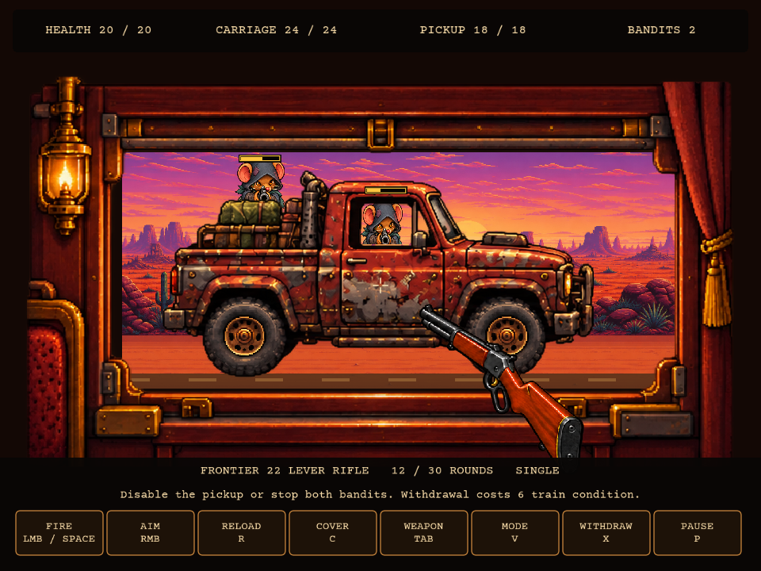
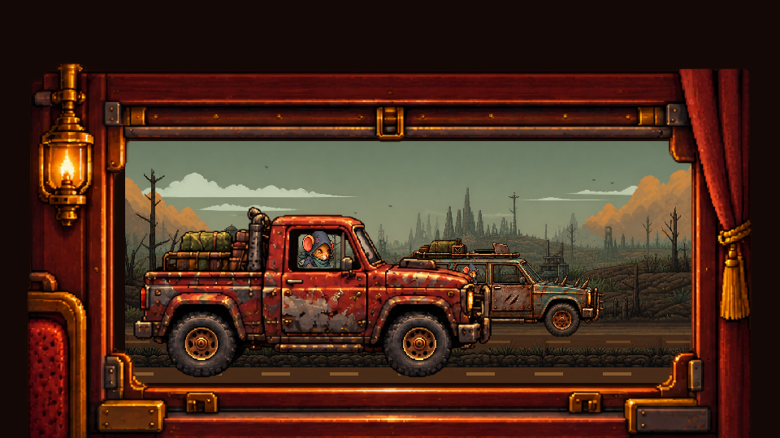
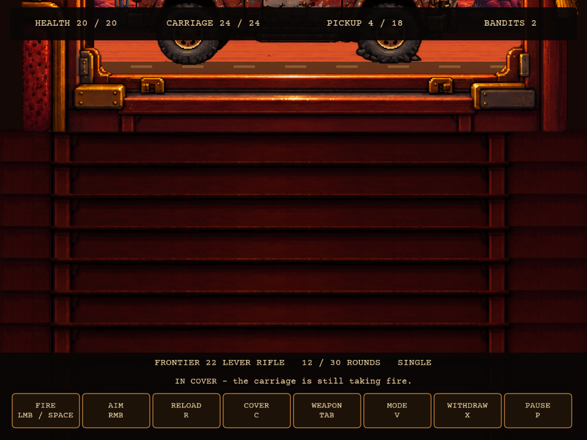

# Train Window Ambush — implementation and refined plan

## Current build

The encounter now presents a two-lane bandit convoy. The near lane holds the baseline pickup. The far lane is shared by the scrap wagon and cargo war rig, which take turns pulling alongside the train. All three use the existing Last Stand first-person weapon system and approved weapon art.

The window, exterior, vehicle shell, wheel animation, bandit actors, weapon and HUD are separate layers. No HUD elements are baked into the train-window sprite. A four-frame authored window loop animates its latch and curtain; a separate four-frame wheel loop animates the pickup.

Rendered previews of the actual scene are included below. These are art previews, not evidence of a completed gameplay or save-resume test. The disposable slot 1 test save was rebuilt separately to force the event during travel.

## Event and choices

The existing `rail-bandits` event now offers:

| Choice | Initial behavior |
| --- | --- |
| Fight | Requires a serviceable owned firearm, compatible ammunition and more than 1 health. Opens the first-person train-window encounter. |
| Hide | Uses up to 2 food and 2 water. Each missing unit costs 4 train condition. Always available, preventing a resource or equipment dead end. |
| Pay scrap | Costs 5 scrap; unavailable below that amount. Resolves without combat. |

These values are starting balance decisions. Hiding with the full supply bundle causes no damage. Shortage penalties and payments are reported after they happen. These are neutral event controls, not spoken player dialogue.

The existing event roll happens when leaving the train at a stop. The ambush is presented as the final moving approach to that stop; the main world is paused while the convoy encounter runs. This implementation reuses that event gate and does not add a second random roll during the travel transition. After the result screen, the player enters the stop through the normal journey flow.

## Combat loop

1. A 1.5-second approach lets the near pickup and the first far-lane vehicle accelerate into position. Both match the train's speed while attacking; the vehicle artwork is grounded on the rail-side terrain.
2. Each vehicle has independent hull, protection, damage scaling, crew positions and attack timers. The far-lane vehicles take turns entering, matching speed, attacking, and accelerating away to the right.
3. Each bandit hides, peeks, aims, fires and ducks. Aim bars fill before shots. Crew use the existing authored Last Stand target poses.
4. The player can aim, use sights, reload, change firing mode, cycle owned firearms and take cover.
5. Hits on exposed crew cause an authored hit pose and interrupt their attack cycle. Door metal, roof and cargo protect the crew behind them.
6. Disable every vehicle or defeat every bandit to win. A vehicle damaged below one-third hull slows and exits left; defeated vehicles accelerate away. When the convoy is gone, the outcome screen reports actual losses and salvage.

There is no kill quota or fixed survival timer. The player is dealing with this one convoy and its crews.

## Initial balance

| Property | Value |
| --- | --- |
| Pickup / wagon / cargo hull | 18 / 14 / 26 |
| Crew per vehicle | 2, with 3 / 2 / 2 health |
| Carriage protection during this encounter | 24 |
| Enemy aim warning | 1.4 seconds |
| Enemy shot damage to carriage protection | 2 |
| Enemy shot damage to persistent train condition | 1 |
| Enemy shot damage to exposed player | 2 |
| Cover transition | 0.16 seconds |
| Victory salvage | 5 scrap, granted once |
| Voluntary withdrawal | 6 train condition, no salvage |

Different firearm calibers deal different damage, using the same starting damage scale as Last Stand. A .22 LR hit deals 1; heavier calibers range up to 3. Damage to hull and crew is independent.

Carriage protection is the current encounter's defense allowance. Train condition is the existing persistent maintenance condition. This first version does not create a new permanent passenger injury system; keeping the carriage protected represents protecting its occupants.

### Cover and failure

Cover drops the view below the window sill, hides the weapon and blocks player fire. Once fully down it prevents player injury. The carriage remains vulnerable while the player is covered, so waiting under the window cannot win the fight.

Reloading is allowed under cover. Running out of ammunition leaves weapon switching and withdrawal available. No loan firearm or free ammunition is offered. An overrun ends the encounter when carriage protection reaches zero or player health reaches 1, matching Last Stand's nonfatal retreat floor. Existing damage remains after the encounter.

## Art and target geometry

Runtime art is under `assets/sprites/events/train-ambush/`:

- `window-rattle.png`: four authored frames, no HUD, weapon, characters or scenery.
- `pickup-damage.png`: intact, damaged, critical and disabled near shells with alpha-zero cab openings.
- `bandit-wagon-damage.png`: four state atlas for the far-lane scrap wagon.
- `bandit-cargo-truck-damage.png`: four state atlas for the far-lane cargo war rig.
- `vehicle-bullet-holes.png`: four transparent bullet and ricochet decals, drawn over the struck vehicle shell.
- `pickup-wheel-frames-source.png`: four authored rolling phases. Only circular tire interiors are sampled; the source's opaque backdrop is excluded from the runtime draw.

The pickup uses a common 543-pixel cell width and a fixed source coordinate rig. The wagon and cargo rig use 768-pixel cells. Crew clipping and shot classification use the same measurements for each vehicle. The vehicle shell's alpha decides whether a shot strikes metal or can reach an exposed actor. Empty window space does not count as hull damage. Bullet holes store the vehicle ID and local art coordinates, so they remain attached while the convoy moves, scales with distance and changes damage stage. The critical and disabled shell art currently includes authored smoke; a separate animated smoke layer remains a possible art improvement.

The train opening is restricted to a common rectangle. Its hit mask checks the opaque trim across all four rattle frames, keeping cover boundaries fixed as details animate. The exterior is clipped behind the window. Window alpha is genuine transparency, not a painted background.

The far lane uses a smaller vehicle scale and remains behind the pickup. Each lane has its own yellow dash line and tire contact line; the far line is higher in the scene and the foreground line is lower. The near pickup is drawn last so it sits in front whenever the silhouettes overlap. Wheel bottoms are used as the grounding anchors for each vehicle atlas.

Draw order:

1. Scrolling landscape and faster rail-side ground.
2. One grounded far-lane vehicle and the near pickup damage-state shell.
3. Vehicle-local bullet-hole decals and crew actors clipped to their firing windows.
4. Authored rolling tire interiors, warnings and transient effects.
5. Authored train-window frame and physical lower wall.
6. The player's existing first-person weapon and reticle.
7. Independent HUD, controls, pause screen and outcome screen.

Reduced-motion settings freeze the decorative parallax, rattle and wheel loops and suppress muzzle flashes. Text uses the game's font and text-size preference.

## Controls

| Action | Mouse / keyboard | Controller / touch |
| --- | --- | --- |
| Aim | Mouse | Right stick / drag the scene |
| Fire | Left mouse / Space | Fire trigger or Last Stand fire binding / FIRE button |
| Sights | Hold right mouse | Aim trigger / AIM toggle |
| Reload | R | Last Stand reload binding / RELOAD |
| Cover | C | Last Stand cover binding / COVER |
| Cycle owned firearm | Tab | Last Stand weapon binding / WEAPON |
| Fire mode | V | Last Stand mode binding / MODE |
| Withdraw | X / button | B / WITHDRAW |
| Pause | P | Start / PAUSE |
| Global menu | Escape | Existing global menu flow |
| Continue after result | Enter / keypad Enter / button | A / CONTINUE |

Existing remapped gameplay keys and Last Stand controller bindings are reused where applicable. X and the ambush-specific controller B/Start actions are direct controls. Touch aiming and firing use separate contacts. Opening menus, changing weapons, taking cover and losing focus clear held fire. Losing focus also pauses the encounter. Normal world movement, camera gestures and mobile movement buttons are suppressed during the encounter.

## Persistence

`saveData.trainAmbush` stores the active phase, timers, per-vehicle hull and crew health/poses, carriage protection, cover state, vehicle-local bullet-hole decals, weapon sessions, ammunition consequences, cumulative losses and result. It contains plain serializable data only. Rendering assets and held-input state are not saved.

The event choice is recorded with the encounter start or alternative cost. A repeated resolution call for the same stop is refused. Victory rewards and the completed event receipt are written together; the outcome guard prevents duplicate salvage. Loading an active saved encounter resumes its stored phase through the main game view. Continuing from the result clears its active flag and enters the stop.

The field is optional in existing schema-35 saves and defaults to an empty table during ordinary normalization. No destructive migration is required.

## Code ownership

- `game/train_ambush_rules.lua`: encounter rules, costs, health, attack sequence and outcomes.
- `game/train_ambush_scene.lua`: art loading, geometry, clipping, animation and shot target classification.
- `game/train_ambush.lua`: weapon session, controls, HUD, pause/resume and application service.
- `game/events.lua` / `game/event_runtime.lua`: event choices and transition into the minigame.
- `game/event_ui.lua`: pickup event illustration and equipment requirement label.
- `game/application_composition.lua`: encounter update, draw and input routing.
- `game/presentation_runtime.lua`: suppression of ordinary mobile movement controls.
- `game/runtime_state.lua` / `game/save_schema.lua`: transient capture flag and optional save field.

The existing Last Stand implementation and approved weapon art are reused without replacing their content. This encounter uses no invented character dialogue. Optional demand, response and retreat lines are listed in `docs/DIALOGUE_REVIEW.md` for user authorship.

## Remaining refinement

Gameplay testing, save/resume exercise and balance tuning remain outstanding. The current art has been rendered for inspection in intact, damaged, critical and covered views. Further polish can include dedicated crew rigs, animated exhaust, suspension frames, driving audio and additional vehicle variants.

## Rendered implementation preview

## Image generation record

The built-in imagegen tool generated the wheel-frame source using the existing pickup damage study as its reference. The prompt requested exactly four intact right-facing pickup driving frames in a 2-by-2 grid, consistent geometry, successive wheel/tread phases, tiny suspension differences, transparent cab openings, and no occupants, scenery, text or HUD. The result contained an opaque backdrop; only the authored tire interiors are used, with circular clipping. The original result is preserved locally with the runtime assets. The damage and window sheets were copied from the earlier concept studies.

The convoy extension adds two generated four-state damage sheets: a teal armored station wagon and a mustard cab-over cargo truck that share the far lane. A separate transparent atlas contains a small bullet hole, a larger punched hole, a wide damaged opening and a ricochet gouge. The encounter stores each decal's vehicle ID and local coordinates so marks move and scale with the struck vehicle.

Exact generation prompt:

> Use case: identity-preserve. Asset type: production 2D pixel-art game animation sprite sheet. Reference image: the FIRST, intact red rusty bandit pickup only. Create exactly FOUR animation frames of that SAME pickup driving, in a regular 2-column by 2-row grid on genuine transparent background. Every cell equal size. Each pickup faces right in exact side view, same scale and wheel positions in each cell. Preserve its red rusty body, scrap armor, hood, spiked bumper, roof, and cargo. Animate the wheels with four distinct authored wheel-spoke/tread phases and tiny suspension compression, no motion blur, no camera change. NO occupants, NO guns or characters, NO scenery, NO ground, NO shadows outside vehicle, NO text, NO labels, NO HUD. Cab side window and windshield must be actual transparent holes so independently rendered enemies can show through; no glass fill. Keep the whole vehicle inside each cell with clear transparent padding. Match reference detailed warm pixel art. Do NOT include damage variants or smoke in this sheet: all four cells are the intact truck at successive driving animation phases.
